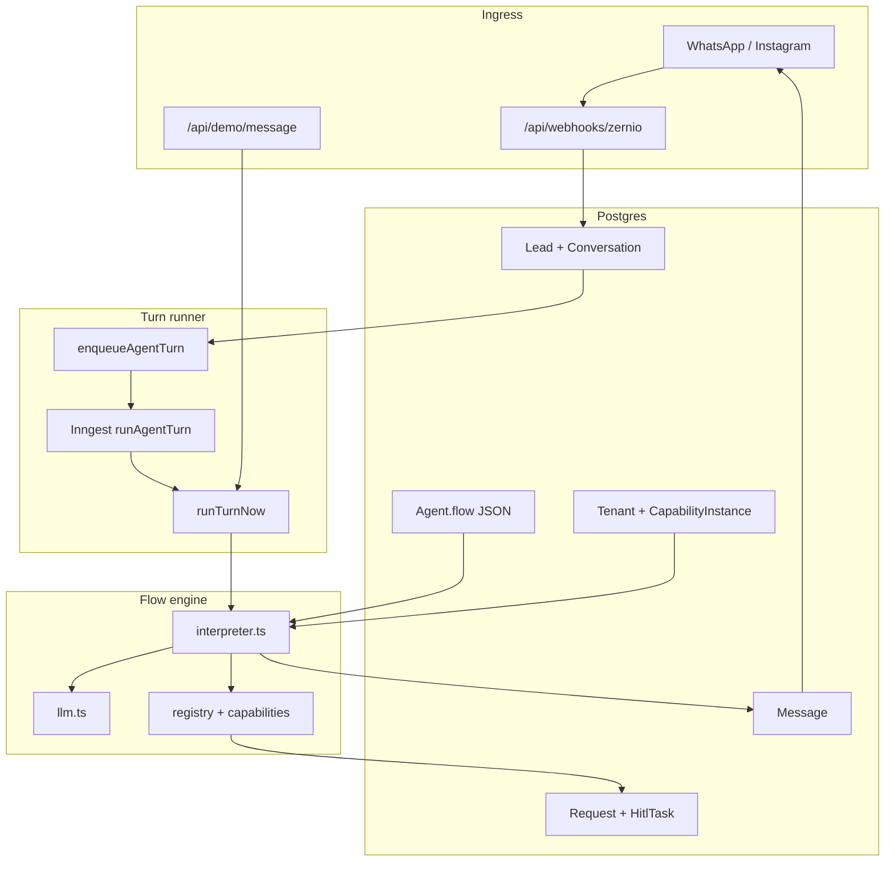
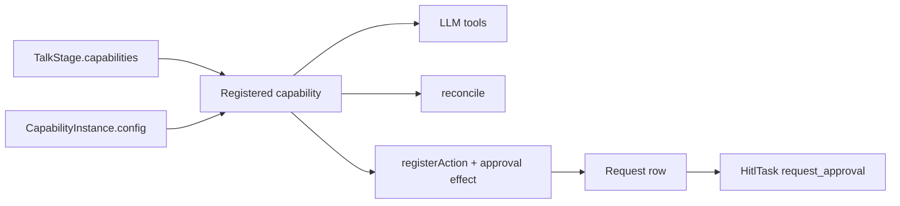

# Leady Architecture

Multi-tenant agent CRM: WhatsApp / Instagram / demo chat → Postgres → flow interpreter → reply. There is no graph framework; the “graph” is JSON on `Agent.flow`, walked each turn by a pure state machine.

Related deep-dives: [nudges.md](./nudges.md), [agent-runtime.md](./agent-runtime.md), [agent-flow-as-data.md](./agent-flow-as-data.md), [agent-state-flow-concurrency.md](./agent-state-flow-concurrency.md). Agent-oriented checklist: [../AGENTS.md](../AGENTS.md).

---

## Mental model (three layers)

1. **Ingress** — webhooks that authenticate, persist, enqueue; never call the LLM.
2. **State** — Postgres: what was said, what we know (`Lead.fields` + `Conversation.session`), where we are (`flowState`), whether a human owns it (`waiting_human`).
3. **Interpretation** — one function (`interpretTurn`) reads JSON + state, calls the LLM *inside* stage/capability guardrails, runs registered effects, sends a reply.

The LLM is a **worker inside stages** (wording, tool choice, extraction). The JSON flow + interpreter + capability hooks are the **rails**. HITL and restart policy are product controls, not graph interrupts.

---

## High-level data flow

| Layer | Location | Role |
|---|---|---|
| UI | `src/app/`, `src/components/` | Demo, onboard, inbox, leads, ops |
| Ingress | `src/app/api/webhooks/`, demo/dev routes | Persist inbound, enqueue or run turn |
| Async | `src/inngest/functions.ts` | Durable `runAgentTurn`, nudges |
| Turn wiring | `src/lib/flow/run-turn.ts` | **Only** place `InterpreterPorts` are wired |
| Kernel | `src/lib/flow/interpreter.ts` | Stage loop; no domain names |
| Registry | `src/lib/flow/registry.ts`, `capabilities/` | Capabilities, effects, actions |
| Fields | `src/lib/flow/fields/` | Typed collect kit (`date`, `enum`, …) |
| Persistence | `src/lib/requests.ts`, `conversations.ts` | Request + HITL; messages; turn context |
| Channels | `src/lib/channels/`, `zernio.ts` | Send / parse |

---

## Most important files

### Must-know (change these carefully)

| File | Why it matters |
|---|---|
| [`src/lib/flow/interpreter.ts`](../src/lib/flow/interpreter.ts) | Closed kernel: stage hop loop, effect dispatch, HITL gate for `request_human`. Domain logic must **not** land here (`architecture.test.ts` “kernel purity”). |
| [`src/lib/flow/run-turn.ts`](../src/lib/flow/run-turn.ts) | Wires ports → LLM / persist / send / `runEffect`. Returns `nudgeEvent`; callers must `dispatchNudgeEvent()` if not going through Inngest. |
| [`src/lib/flow/registry.ts`](../src/lib/flow/registry.ts) | `registerCapability`, `registerAction`, `registerTalkEffect`, `reconcileTalkOutcome`, `decideRegisteredRequest`. |
| [`src/lib/flow/capabilities/index.ts`](../src/lib/flow/capabilities/index.ts) | Bootstraps built-in packs + durable actions. |
| [`src/lib/flow/capabilities/booking.ts`](../src/lib/flow/capabilities/booking.ts) | Point-in-time visit capability (tools + reconcile + decide). |
| [`src/lib/flow/capabilities/reservations.ts`](../src/lib/flow/capabilities/reservations.ts) | Date-span capability (tools + decide). |
| [`src/lib/flow/llm.ts`](../src/lib/flow/llm.ts) | LLM ports: classify / extract / draft / faq / `talkTurn` (tools). |
| [`src/lib/flow/types.ts`](../src/lib/flow/types.ts) | `FlowDefinition`, stages, `TurnContext`, `TalkOutcome`. |
| [`src/lib/requests.ts`](../src/lib/requests.ts) | One persistence primitive for every approval vertical. |
| [`src/lib/conversations.ts`](../src/lib/conversations.ts) | Inbound persist, `loadTurnContext`, field/session split. |
| [`prisma/schema.prisma`](../prisma/schema.prisma) | `Tenant`, `Agent`, `CapabilityInstance`, `Request`, `HitlTask`, … |

### Important supporting

| File | Role |
|---|---|
| `src/lib/flow/catalog.ts` | `flowForCapabilities` / legacy `flowForCatalog` |
| `src/lib/flow/validate.ts` | Validate flow on write |
| `src/lib/flow/prompt-builder.ts` | Talk system prompt assembly |
| `src/lib/flow/fields/` | Field types: ask / normalize / gaps / confirm |
| `src/lib/flow/booking-config.ts`, `reservation-config.ts` | Parse instance `config` JSON |
| `src/lib/capability-instances.ts` | CRUD for `CapabilityInstance` |
| `src/lib/meetings.ts`, `reservations.ts` | Vertical wording + mapping onto `Request` |
| `src/lib/flow/effects.ts` | Generic `registerApprovalEffect`, kernel talk effects |
| `src/app/api/requests/[id]/decide/route.ts` | One decide route for all verticals |
| `src/app/api/hitl/[id]/complete/route.ts` | HITL completion → decide or resume turn |
| `src/lib/tenant.ts` | `requireTenantId()` — every query scopes on this |
| `src/lib/copy/`, `src/lib/ui/` | Lead-facing vs operator i18n (do not mix) |
| `src/lib/flow/architecture.test.ts` | Guards kernel purity, one Request, instances |

---

## Core abstractions

### Flow-as-data

`Agent.flow` is a `FlowDefinition`: `start`, `restartPolicy`, `stages` (`classify` | `collect` | `faq` | `talk` | `action` | `terminal`). Validated on save (`validateFlow`), versioned (`flowVersion` + `AgentConfigRevision`). Production catalogs are talk-centric (`inbox` / `faq`); legacy `book` → inbox + proactive booking.

### Ports

The interpreter never imports Prisma, channels, or the LLM. It receives `InterpreterPorts`. **`run-turn.ts` is the only production wiring site.** Inngest wraps `runTurnNow()`; it does not re-wire ports.

Generic durable work uses one port: `runEffect(ctx, effectId)` → action registry. Adding a capability must not add a named port (`bookMeeting`, …).

### Capabilities + instances + requests

- **Capability** (code): registered pack — prompt lines, tools, reconcile, decide, session keys.
- **CapabilityInstance** (data): per-tenant config — field list, nouns, hours, templates, availability. One tenant can have several kinds (`visit`, `rental`, …).
- **Request** (data): one pending/approved commitment — `capabilityId`, `kind`, `startAt`/`endAt`/`timeText`, `data` JSON. HITL type is always `request_approval`.

A barber vs villa vs dress shop is mostly **instance config**, not a new table.

### Typed field kit

`src/lib/flow/fields/` — each *type* implements ask / normalize / gaps / render once. Capabilities describe collect lists as `FieldSpec[]`. New verticals should add specs, not per-field `if (id === "guests")` branches.

---

## How a turn runs

1. Ingress: `persistInboundIfNew` (idempotent) → `enqueueAgentTurn` **or** demo calls `runTurnNow` directly.
2. `loadTurnContext` — tenant, agent, conversation, messages, fields, `capabilityInstances`, capability `loadState` into `ctx.capabilityState`.
3. If `waiting_human` and not `resume` → hold message; stop.
4. If on terminal → `restartPolicy` (usually fall back to `talk`).
5. Interpreter loop (max 8 hops) on `stage.type`:

| Stage | Deterministic shell | LLM role |
|---|---|---|
| `classify` | Map intent → `transitions[intent]` | Pick intent (or heuristic first intent) |
| `collect` | Persist extract; if gaps → ask + nudge; else → `on_complete` | Extract fields; draft question wording |
| `faq` | Branch `on_resolved` / `on_unresolved` | Answer from knowledge (or UNRESOLVED) |
| `talk` | Persist fields; run effects; enforce allowed transitions; HITL / complete / nudge | Tool loop: reply, capability tools, transition |
| `action` | Run action → `on_complete` / `on_fail` | None (except if action itself calls LLM — none today) |
| `terminal` | Return | None |

6. Outbound via `sendAndSave` (DB + channel). Optional nudge event (Inngest or `dispatchNudgeEvent`).

Concurrency: Inngest `concurrency: [{ key: conversationId, limit: 1 }]`.

---

## LLM vs deterministic (when each decides)

### Deterministic (code always wins)

- Which **stage** runs next from classify/collect/faq/action edges.
- **Illegal talk transitions** — dropped if not in `talkTransitionTargets(stage)`.
- **HITL policy** — `assertHitlAllowed` before escalate.
- **Capability reconcile** — e.g. booking injects `book_meeting` after customer affirmation when gaps are empty; blocks complete-while-booking.
- **Tool execute bodies** — validation (hours, email, gaps), pushing effects, locking reply text from `ask_field`.
- **Talk effects** — `book_meeting` / `create_reservation_hold` create Request + HITL and park on `waiting_human`; `request_human` sets escalate reason.
- **Action stage** — registry/`request_human` only; no free-form LLM branch.
- **waiting_human** without resume — no agent turn beyond hold.
- **Stale nudge** — skip if `flowVersion` changed.
- **Tenant isolation** — every query filtered by `requireTenantId()`.

### LLM (advisory / wording / tool choice)

Inside ports only, mainly on **`talk`** (production catalog):

| Port | What the model does | What still constrains it |
|---|---|---|
| `talkTurn` | Chooses tools (`reply`, `start_booking`, `save_fields`, …); drafts customer text | Tools are capability-gated; execute() validates; reconcile + effects after |
| `classifyIntent` | Picks an intent string | Must be in `stage.intents`; interpreter maps via JSON |
| `extractFields` | Fills field bag from transcript | Only schema keys; missing still asked |
| `draftQuestion` | Phrases the next ask | Interpreter already decided *which* field |
| `answerFaq` | Answers or UNRESOLVED | Knowledge-bound; unresolved path is fixed |
| `draftNudgeReply` | Silence follow-up wording | Scheduled only if stage nudge rules pass |

**Rule of thumb:** the model proposes *what to say* and *which registered tools to call*; the interpreter and capability code decide *whether it sticks* and *what is persisted*.

Without API keys (`llmConfigured() === false`): classify/extract degrade to heuristics; talk uses `degradeTalk` (intro or escalate). Tests need no keys.

---

## Adding a new capability

Prefer **config** (new `CapabilityInstance` with field specs + nouns) when the shape is still “collect → confirm → Request → HITL”. Add **code** only for a new pack or field type.

### Config-only (new business type)

1. Enable an existing capability on the talk stage (`booking` and/or `reservations`) via onboard / `flowForCapabilities`.
2. Upsert `CapabilityInstance` (`src/lib/capability-instances.ts` or `/api/tenant/capability-instances`) with `kind`, `config` (collect, nouns, templates, hours, availability).
3. No interpreter change. Dress shop with fitting + rental = two instances.

### New capability pack (code)

Checklist (see also `src/lib/flow/capabilities/README.md`):

1. **`src/lib/flow/capabilities/<id>.ts`** — `registerCapability({ id, promptSection, tools?, reconcile?, loadState?, decide?, sessionFieldKeys?, … })`.
2. **`capabilities/index.ts`** — call register; `registerAction("<effect>", …)` + `registerApprovalEffect({ effectId, capabilityId })` for submit-for-approval.
3. **`catalog.ts`** — add to `CapabilityId` / `isCapabilityId` if onboard should list it.
4. **Collect** — build `FieldSpec[]` via `fields/`; config parser module if needed.
5. **Persistence** — use `@/lib/requests` (`createRequestWithApprovalTask`, `decideRequest`). Thin wrapper in `src/lib/<vertical>.ts` for wording only. **Do not** add `Meeting`-style tables or decide routes.
6. **UI** — inbox already uses `request_approval` + `RequestDecisionForm`; extend labels via instance/`request-view` if needed.
7. **Copy** — mechanics in `copy/`; nouns in instance config.
8. **Tests** — capability registration + `architecture.test.ts` still green (no domain leak into interpreter; no second decide form).

**Do not:** edit `interpreter.ts` for domain rules; import `prisma` from a capability file; add a per-capability port on `InterpreterPorts`.

### New field type

Add one handler in `src/lib/flow/fields/handlers.ts` + type in `types.ts`. Capabilities gain a new `FieldSpec` variant without per-vertical code.

---

## Onboarding a tenant

1. Admin/`createTenant` or seed → Tenant + Agent (`flowForCatalog("inbox")`) + demo channel + default booking instance.
2. Owner `/onboard` → capabilities, stance, collect, knowledge → `POST /api/onboard` → `flowForCapabilities` + `CapabilityInstance` upserts + agent revision.
3. Connect channel (Zernio / HookMyApp) or keep demo.

---

## Extensibility map

| Goal | Prefer |
|---|---|
| New vertical same as visit/stay | Instance config + field specs |
| New collect field shape | Field kit type |
| New approval domain | Capability pack + `Request` |
| New stage type (`score`, …) | Interpreter + types + validate (rare) |
| New language | `copy/` + `ui/` |
| Calendar API | New availability `kind` on instance config |

---

## Invariants (do not break)

1. Interpreter stays domain-free (`architecture.test.ts`).
2. One `Request` model, one `request_approval` HITL type, one decide route/form.
3. Capability config on `CapabilityInstance`, not new Tenant columns.
4. Ports wired only in `run-turn.ts`.
5. Direct `runTurnNow` callers dispatch nudges themselves.
6. Lead copy vs operator UI stay separate.
7. Every Prisma query filters `tenantId` from `requireTenantId()`.
