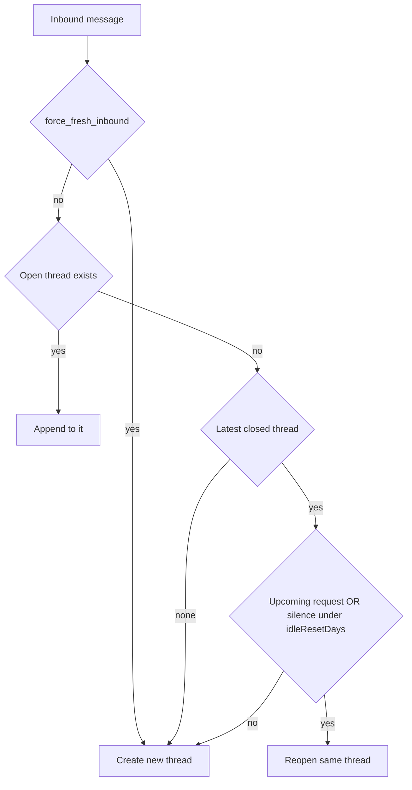

# Conversation lifecycle

When a lead’s message continues an existing thread versus starting a new one, and when staff or the agent closes a conversation.

Canonical code: [`src/lib/flow/rotate-conversation.ts`](../src/lib/flow/rotate-conversation.ts) (`decideInboundThread`, `closeConversationAsDone`, `reopenConversation`, `rotateConversation`), [`src/lib/conversations.ts`](../src/lib/conversations.ts) (`persistInboundIfNew`). Architecture map: [architecture.md](./architecture.md).

---

## Statuses

| Status | Meaning |
|---|---|
| `open` | Agent can reply; inbound appends here. |
| `waiting_human` | Parked for HITL; inbound gets a hold line until resume. |
| `closed` | Resolved in the CRM inbox. Transcript and `Request` rows stay; ephemeral `session` is wiped. |

`lifecycleReason` records why the thread opened or closed: `inbound_create`, `inbound_reopen`, `approve`, `admin`, `done`, `start_new_conversation`, `hitl_resume`, …

---

## When we close

All of these call `closeConversationAsDone` or `rotateConversation` (which closes the current open thread first):

| Trigger | Where | Reason |
|---|---|---|
| Staff approves a visit/stay | `meetings.ts` / `reservations.ts` → decide & HITL routes | `approve` |
| Model reaches talk `on_complete` (`done`) | `run-turn.ts` | `done` |
| Staff “end chat” | `api/leads/[id]/new-conversation` `intent=end` | `admin` (+ `force_fresh_inbound`) |
| Staff “start new” / agent `start_new_conversation` | rotate | `admin` / `start_new_conversation` |

**Close wipes:** `Conversation.session` and any booking/reservation session keys still on `Lead.fields`.

**Close keeps:** message transcript, approved/pending `Request` rows, CRM fields on the lead (`name`, `phone`, …).

Approve closes for inbox hygiene. The next customer message can reopen the same thread (see below) — a thank-you does not start a blank conversation.

---

## When inbound continues vs creates

Deterministic decision in `persistInboundIfNew` **before** any LLM call:



```ts
export function decideInboundThread(opts: {
  forceFresh: boolean;
  hasOpenConversation: boolean;
  closedLastMessageAt: Date | null;
  idleResetDays: number;
  hasRelevantRequest: boolean;
  now?: Date;
}): "use_open" | "reopen" | "create" {
  if (opts.forceFresh) return "create";
  if (opts.hasOpenConversation) return "use_open";
  if (!opts.closedLastMessageAt) return "create";
  if (opts.hasRelevantRequest) return "reopen";
  return conversationIdleExpired({
    lastMessageAt: opts.closedLastMessageAt,
    idleResetDays: opts.idleResetDays,
    now: opts.now,
  })
    ? "create"
    : "reopen";
}
```

| Signal | Effect |
|---|---|
| `force_fresh_inbound` (staff ended chat) | Always create |
| Any non-closed conversation | Append |
| Closed + upcoming relevant `Request` | Reopen even past idle window |
| Closed + silence &lt; `Tenant.idleResetDays` (default 5) | Reopen |
| Closed + silence ≥ idle days, no upcoming request | Create |
| No prior conversation | Create |

Reopen sets `lifecycleReason: "inbound_reopen"` and `flowState` back to `talk`.

`conversationIdleExpired` is the production clock for that window; `isIdleConversationReset` is only a **prompt hint** on an already-open thread (gap between the last two messages in context).

---

## LLM rotation (same talk call)

The model does **not** choose the inbound thread. It may call `start_new_conversation` only when the tool is gated on:

- customer short-yes after we asked to reset, or
- idle-gap turn (`isIdleConversationReset`), or
- `lifecycleReason === "inbound_reopen"` (decide + intro wording in one `talkTurn` — no second LLM round-trip).

On `inbound_reopen`, the talk prompt states that a thank-you / follow-up about the prior approval is **not** a new matter. Booking and reservations capabilities still strip `start_new_conversation` while collect is active.

---

## Staff intents

`POST /api/leads/[id]/new-conversation`:

| Intent | Behavior |
|---|---|
| `end` | Close open threads; set `force_fresh_inbound` so the next customer message creates a new thread |
| `start` | Rotate to a brand-new empty conversation (refuses if one is already open) |
| `reopen` | Staff reopen of a closed conversation (`admin_reopen`) |

---

## What not to do

- Do not auto-create a new conversation on approve (close the thread; let inbound reopen).
- Do not reopen forever: past `idleResetDays` without a relevant request → new thread.
- Do not add a second LLM call to choose the thread; routing stays in `decideInboundThread`.
- Do not treat “תודה” as a new matter after approve — that is the reopen + prompt guard.
