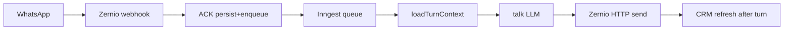

# Production latency - findings, passes, and how to read them

Living summary of the Zapidly reply-path + CRM latency work (Oct 2026). Numbers are from **production** Vercel Runtime Logs unless noted. Local Phase 0 probes were useful for structure, but they mis-ranked the live bottleneck (local turns looked ~99% LLM; prod was Neon RTT + webhook work + later Inngest queue + Zernio).

Related: [architecture.md](./architecture.md), [nudges.md](./nudges.md), [AGENTS.md](../AGENTS.md).

---

## 1. Executive picture (after pass six)

Two surfaces, two stories:

| Surface | Who feels it | Dominant cost now | Status |
|---|---|---|---|
| **Customer reply** (WhatsApp/IG → agent) | Lead waiting for an answer | **Inngest queue (~0.5–1.6s)** + **LLM (~1.1–1.6s)** + **Zernio HTTP (~1–1.8s)** | DB/load cheap; queue now measured |
| **CRM** (`/leads`, lead peek) | Operator navigating inbox | Mostly **client RTT + paint**; server lead view **~50–95ms** when region-aligned | Large win vs early prod |

**Typical customer-visible wait today** (real WhatsApp sample post–pass six):

```text
webhook ACK     ~0.5s   (persist + enqueue)
+ Inngest queue ~1.6s   (queue_ms - was invisible before)
+ turn work     ~3.2s   (LLM ~1.3s + Zernio send ~1.8s; load ~40ms)
≈ ~5s class
```

Demo / non-Zernio channels show `send_http_ms: 0` and shorter turn totals - do not use those as WhatsApp SLOs.

---

## 2. Bottleneck summary

### Customer reply path



| Slice | On customer path? | Approx now | Notes |
|---|---|---|---|
| Webhook persist + enqueue | Yes (before turn starts) | ~0.4–0.5s | Was ~3.9s at first prod sample |
| **Inngest `queue_ms`** | Yes | **~0.5–1.6s** (outlier ~6s) | Pass six; decide next if routinely &gt;1s |
| `load_ms` | Yes | ~20–60ms | Was ~1.1s when Vercel≪Neon region |
| `talk_llm_ms` | Yes | ~1.1–1.6s | Provider floor; 2 tool steps typical (`reply`) |
| `send_http_ms` | Yes | ~1.0–1.8s | Zernio API; not cuttable in-app |
| `refresh_ms` after send | No (post-reply) | ~20–80ms | Was hundreds–1s+ before denorm / region |

**Not the reply bottleneck anymore:** Prisma select surgery, CRM count fan-out on the webhook, double CRM refresh on inbound, extra Inngest `load-context` step (removed).

**Out of scope / explicit non-goals so far:** sync turn inside the webhook (durability / double-send risk), Redis as primary fix, rewriting Zernio, switching default chat model without A/B.

### CRM path

| Slice | Approx now | Notes |
|---|---|---|
| Instant peek shell (`crm.client.peek_shell`) | **0ms** | Paint from list row before fetch |
| Server `crm.load_lead_view` | **~46–95ms** | Was ~1.5–2.1s pre–region pass |
| Client `peek_open` / `peek_paint` | med ~0.5s (cold spikes ~1.5s) | Network + React; not Neon query wall |
| `crm.leads_page` | med ~400ms | Was multi-second |
| `crm.nav_counts` / row loads | tens of ms | Count collapse + cache |

**Root cause of early CRM “slowness”:** each Neon round-trip from **Vercel `iad1` → Neon `eu-west-2`** cost ~1–1.5s. Slimming selects without moving region did not move the wall clock. Pass five (`lhr1`) fixed that.

---

## 3. Pass-by-pass changelog

### Phase 0 / telemetry (foundation)

**Logical change:** always-on JSON spans (not gated on `PERF_LOG` for turn/CRM hot paths).

**Look for:** `runAgentTurn`, `zernio.inbound`, `crm.*`, later `crm.client.*`.

**Influence:** no product behavior change; made every later pass falsifiable.

---

### Pass one - enqueue sooner, fewer Neon RTTs on inbound

| Change | Logical / product effect |
|---|---|
| Stop CRM `safeRefreshLeadState` inside `persistInboundIfNew` happy path | Inbound ACK no longer waits on full CRM snapshot |
| Collapse inbound round-trips (channel in, parallelize checks) | Same persistence semantics; fewer queries |
| Slim `loadTurnContext` (message take 16, tighter selects) | Same interpreter inputs; less payload |
| CRM count collapse / default-tab fix | Fewer count queries on `/leads` |
| Fix `inngest.turn` timer inside `step.run` | Measurement only |

| Metric | Before (first prod) | After pass one |
|---|---|---|
| Webhook ACK (`zernio.inbound` ms) | ~**3900** | ~**1240** |
| Turn load | ~1100 | still heavy (region) |

---

### Pass two - one refresh, denorm clocks, one LLM step, CRM list RTTs

| Change | Logical / product effect |
|---|---|
| Remove happy-path webhook `after(refresh)` | **One** CRM refresh per inbound (owned by the turn) |
| Denormalize `lastLeadMessageAt` / outbound clocks on write; skip common `message.groupBy` in refresh | Same CRM stage math; cheaper snapshot |
| Fold intent into `reply` tool (drop mandatory `set_intent` round-trip) | Same intent on lead when model supplies it; **one** `generateText` step for plain talk |
| Parallel capability instances with convo load | Same context; less wall time |
| Slim list rows + React `cache` for tenant/labels | Same UI data |

| Metric | Pass one-ish | After pass two |
|---|---|---|
| `talk_llm_ms` (plain talk) | ~**4300** (2 steps) | ~**1400** (1–2 steps, `tools_used: ["reply"]`) |
| `crm.leads_page` | ~2–3.6s | ~**1.0–1.3s** |
| Duplicate inbound refresh | yes | **gone** |

**Do not revert:** data justified keeping all of this.

---

### Pass three - CRM nav feel (mark-read, peek overlap)

| Change | Logical / product effect |
|---|---|
| Mark-read/unread: no `router.refresh()`; single `updateMany` | Unread badge updates without full `/leads` reload |
| Overlap/slim `loadLeadView` (parallel labels + lead) | Same DTO; still one fat RTT |
| AppShell: cached tenant shell / cheaper team-nav gate | Same nav; fewer Clerk/DB hits |
| Refresh snapshot: per-field denorm fallbacks; fold `linkSent` | Same refresh outputs |

| Metric | Expectation | Result |
|---|---|---|
| `crm.load_lead_view` | Big drop | **Little change** - still ~1.5–2s (RTT dominated) |
| Mark-read induced `crm.leads_page` | Gone | **Win** for perceived nav |

**Lesson:** overlap/select surgery ≠ latency when each query is ~1.5s overseas.

---

### Pass four - chat-first peek + client metrics

| Change | Logical / product effect |
|---|---|
| `LeadViewScope` `lite` \| `full` | Peek loads chat-first; Activity/Details pull `full` |
| `POST /api/perf/crm` → `crm.client.*` | Operator-felt timings in logs |
| Peek UX aligned to chat-first | Same data eventually; different load order |

| Metric | Result |
|---|---|
| Server payload size | Down on lite |
| Felt peek | Still slow until region move - **proved payload ≠ RTT** |

---

### Pass five - region + instant shell (biggest CRM win)

| Change | Logical / product effect |
|---|---|
| Vercel region **`lhr1`** (`vercel.json` + `preferredRegion`) | Same app; compute near Neon `eu-west-2` |
| Instant peek shell from list row (`shellFromRow` / `peek-shell`) | Header/identity paint **before** lite fetch; chat may skeleton |

| Metric | Before | After pass five |
|---|---|---|
| `crm.load_lead_view` / `lead_ms` | ~1.5–2.1s | **~46–95ms** |
| `crm.client.peek_shell` | n/a | **0ms** |
| Turn total (real WA) | multi-second DB heavy | ~**2.6s** in-process (LLM+Zernio) before queue measured |
| Reply feel | still “seconds” | DB no longer the story |

**Do not revert region / CRM shell.**

---

### Pass six - queue visibility + less wait before LLM

| Change | Logical / product effect |
|---|---|
| `inboundAt` on `agent/turn.requested`; log **`queue_ms`** | Measurement; same turn semantics |
| Fold Inngest `load-context` into single `interpret` step; missing convo → `skipped: missing_conversation` | Same skip behavior; **one** durable step boundary |
| Talk `maxRetries` 2→1; talk transcript `slice(-8)` | Faster fail on rare LLM errors; slightly smaller talk prompt; stages unchanged |
| Keep `stepCountIs(8)` | No raise |

| Metric | Pass five | Pass six remeasure |
|---|---|---|
| `queue_ms` | unknown | **~0.5–1.6s** typical; outlier **~6s** |
| Inngest steps | load-context + interpret | **interpret only** |
| `talk_llm_ms` | ~1.3s | ~1.1–1.6s (flat) |
| `send_http_ms` (real WA) | ~1.0–1.2s | ~**1.8s** sample (provider variance) |
| Webhook | ~0.4s | ~**0.5s** (`enqueue_ms` ~380) |

---

## 4. Improvement tables (by feature)

### A. Inbound webhook → enqueue

| Pass | What changed | Latency effect |
|---|---|---|
| 1 | No refresh in persist; fewer queries | ACK **~3.9s → ~1.2s** |
| 2 | No happy-path deferred refresh | Removes second CRM burn on inbound |
| 6 | `inboundAt` stamped at enqueue | Enables `queue_ms` |

### B. Agent turn (interpret → reply)

| Pass | What changed | Latency effect |
|---|---|---|
| 1 | Slimmer load | Modest until region |
| 2 | Intent-on-reply; parallel load pieces | LLM **~4.3s → ~1.4s** class |
| 5 | `lhr1` | Load/refresh **~seconds → tens of ms** |
| 6 | Drop extra Inngest step; talk retries/window | Removes step overhead; queue **visible** |

### C. Outbound WhatsApp (Zernio)

| Pass | What changed | Latency effect |
|---|---|---|
| (ongoing) | Parallel persist + token fetch before HTTP | Small overlap win |
| - | Provider HTTP itself | Still **~1–1.8s**; accept as floor |

### D. CRM list / nav

| Pass | What changed | Latency effect |
|---|---|---|
| 1–2 | Count collapse, slim rows, cache | **/leads multi-s → ~1s** then better with region |
| 3 | No refresh on mark-read | Snappier unread toggles |
| 5 | Region | Counts/rows **tens of ms** |

### E. Lead peek

| Pass | What changed | Latency effect |
|---|---|---|
| 3–4 | Slim/overlap/lite scope | Structure ready; wall clock stuck on RTT |
| 5 | Instant shell + region | **Shell 0ms**; server view **&lt;100ms** |

---

## 5. What actually changed logically (product / flow)

Safe summary for reviewers: **rails unchanged**. Interpreter still owns stages, HITL, transitions, effects. One `Request` primitive. Ports still wired only in `run-turn.ts`.

| Area | Behavior change? | Detail |
|---|---|---|
| Flow JSON / stages | No | Catalog + `validateFlow` unchanged by these passes |
| When a turn runs | No | Still webhook → Inngest → `runTurnNow` (demo may run sync) |
| What the model may do | Mild | Intent collected via `reply` tool instead of a separate `set_intent` call |
| HITL / booking / reservations | No | Capability packs + `requests.ts` unchanged in intent |
| CRM stage computation | No | Same `refreshLeadState`; cheaper inputs (denorm clocks) |
| Peek UX | Yes (perceived) | Shell paints immediately; lite then full |
| Mark-read | Yes (perceived) | No full inbox remount |
| Region | Ops | London compute; same code paths |
| Nudges | No intentional change | Still `cancelOn` turn; pass six must not regress `nudgeIfSilent` / digest |

---

## 6. What to look for (ops / debugging)

Search Vercel Runtime Logs (production) after a WhatsApp message + opening a lead:

| Log `msg` | Key fields | Meaning |
|---|---|---|
| `zernio.inbound` | `persist_ms`, `enqueue_ms`, `ms` | Webhook ACK budget |
| `zernio.enqueue_failed` | `error` | Turn never starts (seen once as `fetch failed` - transient?) |
| `runAgentTurn` `phase:enter` | **`queue_ms`**, `triggerMessageId` | Inngest wake gap |
| `runAgentTurn` `phase:exit` | `ms`, `talk_llm_ms`, `talk_steps`, `tools_used`, `load_ms`, `send_http_ms`, `send_persist_ms`, `refresh_ms`, `queue_ms` | Full turn split |
| `inngest.turn` | `interpret_ms` | Single interpret step wall (inside worker) |
| `crm.leads_page` / `crm.load_lead_rows` / `crm.nav_counts` | `ms` | Inbox server work |
| `crm.load_lead_view` | `ms`, `scope`, `lead_ms` | Peek/server view |
| `crm.client.peek_shell` / `peek_open` / `peek_paint` | `ms`, `scope` | Operator-felt peek |
| `crm.refresh_slow` | - | Should be rare; investigate if common |

**Healthy real WhatsApp turn (ballpark):**

- `queue_ms` &lt; 1s (investigate if often &gt;1s or spikes to multi-seconds)
- `load_ms` &lt; 100
- `talk_llm_ms` ~1–2s, `talk_steps` 1–2, `tools_used` includes `reply`
- `send_http_ms` ~1–2s (provider)
- No `enqueue_failed`

**Healthy peek:**

- `peek_shell` ≈ 0
- `load_lead_view` lite/full &lt; ~150ms server-side after region pin

---

## 7. How this influences the app going forward

1. **Optimize where the clock is.** Reply work is **queue + LLM + Zernio**, not Prisma cosmetics. CRM work after pass five is mostly **client UX**, not more SQL.
2. **Region is a product dependency.** Pinning `lhr1` (near Neon `eu-west-2`) is load-bearing. Moving compute back to US without moving the DB reverts CRM/reply DB slices.
3. **Telemetry is part of the contract.** New reply-path work should preserve `queue_ms` / `send_http_ms` / `talk_llm_ms` on exit logs.
4. **Closed kernel still applies.** Latency passes must not put domain rules in `interpreter.ts` or add parallel Request tables.
5. **Next lever for reply feel** (if `queue_ms` stays routinely &gt;1s): durable **alternative wake** (not more select trimming). Do not run the full turn synchronously in the webhook without a durability design.
6. **Zernio ~1s+** is an external floor - product expectations should include it unless the provider changes.

---

## 8. Key files touched (map)

| Concern | Primary files |
|---|---|
| Turn timing / enqueue / ports | `src/lib/flow/run-turn.ts`, `src/lib/perf.ts` |
| Inngest steps | `src/inngest/functions.ts` |
| Talk LLM | `src/lib/flow/llm.ts` |
| Inbound webhook | `src/app/api/webhooks/zernio/route.ts`, `src/lib/conversations.ts` |
| CRM refresh / denorm | `src/lib/crm/refresh.ts` |
| Lead peek / scopes | `src/lib/crm/view-lead.ts`, `src/components/crm/LeadPeek.tsx`, `peek-shell.ts`, `crm-perf.ts` |
| Client CRM metrics | `src/app/api/perf/crm/route.ts` |
| Region | `vercel.json`, `src/app/layout.tsx`, `src/app/(app)/layout.tsx` |

---

## 9. Snapshot - latest production pull (post pass six)

Approximate 3h window after the latency deploy:

| Metric | Observed |
|---|---|
| `queue_ms` | typical **517–843**; some **1.5–1.6s**; outlier **6004** |
| `talk_llm_ms` | **1111–1699** |
| Real WA `send_http_ms` | **1801** (one sample) |
| Real WA turn `ms` | **3200** (+ queue before enter) |
| Demo turns `send_http_ms` | **0** (ignore for WA SLO) |
| `zernio.inbound` | persist **75**, enqueue **381**, total **457** |
| `crm.load_lead_view` | **46–95** |
| `crm.client.peek_shell` | **0** |
| `crm.leads_page` | med **~406** |

Update this section when you remeasure after the next reply-path change.
