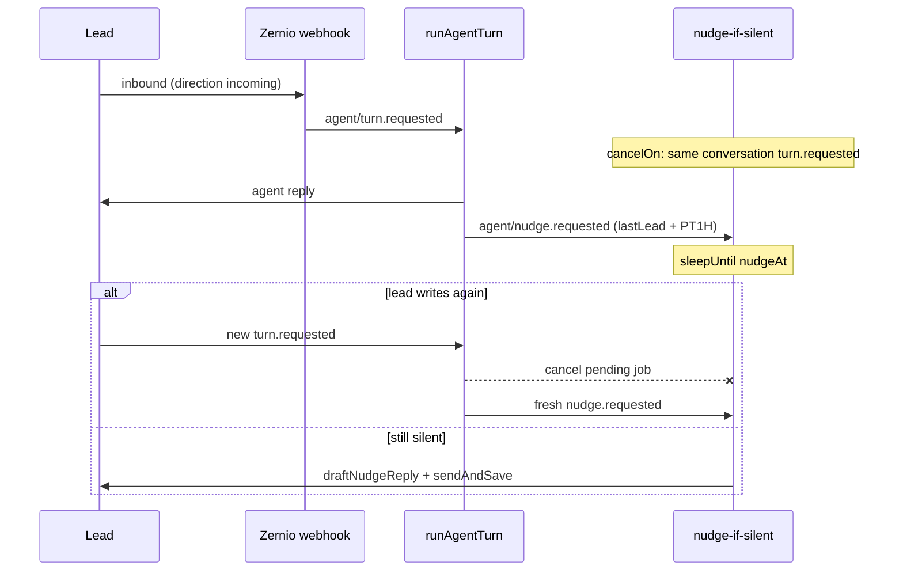

# Silence nudges

A **nudge** is a follow-up WhatsApp/Instagram message when the lead goes quiet. It is not part of the inbound turn. The turn replies immediately; Inngest sleeps until `last lead message + duration`, then maybe sends one reminder.

Canonical code: [`src/inngest/functions.ts`](../src/inngest/functions.ts) (`nudgeIfSilent`), [`src/lib/flow/run-turn.ts`](../src/lib/flow/run-turn.ts) (`buildNudgeRequestedEvent`), [`src/lib/flow/helpers.ts`](../src/lib/flow/helpers.ts). Architecture map: [architecture.md](./architecture.md).

---

## Clock

The timer is anchored on the **lead’s last message**, not the agent reply.

```
nudgeAt = lastLeadMessageAt + ISO-8601 duration
```

Talk stages default to **`PT1H`** (`defaultTalkNudge` in [`src/lib/flow/catalog.ts`](../src/lib/flow/catalog.ts)). Locally, `NUDGE_AFTER_OVERRIDE` (for example `PT5M`) replaces that duration in every environment where it is set.

If `nudgeAt` is already in the past on this turn, **no event is scheduled**. A HITL resume or a turn whose last lead message is hours old must not fire immediately.

---

## Flow JSON

Optional per-stage spec. Talk gets the catalog default even when `nudge` is omitted.

```ts
export type NudgeSpec = {
  after: string;      // ISO-8601 duration, e.g. "PT1H"
  template: string;   // instruction to draftNudgeReply (not sent verbatim to the lead)
  maxTimes?: number;  // unused at runtime; cancel-on-turn is the cap
};
```

```ts
// src/lib/flow/catalog.ts
export const defaultTalkNudge: NudgeSpec = {
  after: "PT1H",
  template:
    "Brief follow-up after silence: invite them to continue the same thread; re-ask the last open question if there was one; stay warm and short.",
};

export function nudgeSpecForStage(stage: Stage): NudgeSpec | undefined {
  if (stage.nudge) return stage.nudge;
  if (stage.type === "talk") return defaultTalkNudge;
  return undefined;
}
```

Override on a stage if you need a different wait:

```json
{
  "type": "talk",
  "nudge": {
    "after": "PT23H",
    "template": "Short reminder; stay in the same thread."
  }
}
```

FAQ / terminal stages have no default. Collect can set `nudge` explicitly; the interpreter schedules after asking a missing field.

---

## Lifecycle



1. Interpreter finishes a collect-ask or a talk stay-on-stage reply and calls `ports.scheduleNudge`.
2. `runTurnNow` **records** the event (`nudgeEvent`); it does not send it.
3. `runAgentTurn` `step.sendEvent`s it. Demo / HITL resume call `dispatchNudgeEvent()` themselves.
4. `nudge-if-silent` `sleepUntil(nudgeAt)`, then re-reads the conversation and either sends or skips.

The interpreter never sleeps waiting for the next lead message. The next inbound is a new webhook → new `agent/turn.requested`. Sleep is only the silence timeout.

---

## Schedule (do not send from the interpreter)

`run-turn.ts` is the only production port wiring site. The `scheduleNudge` port only builds an Inngest event:

```ts
export function buildNudgeRequestedEvent(
  ctx: TurnContext,
  stageId: string,
  stage: Stage,
  triggerMessageId?: string,
): NudgeRequestedEvent | null {
  if (!shouldScheduleNudge(ctx, stageId, stage)) return null;
  if (!triggerMessageId) return null;
  const nudge = resolvedNudgeSpec(stage);
  if (!nudge) return null;
  const after = resolveNudgeAfterDuration(nudge.after);
  const anchorAt = lastLeadMessageAt(ctx.messages);
  const nudgeAt = resolveNudgeFireAt(anchorAt, after);
  if (!nudgeAt) return null; // already due — skip this turn
  return {
    name: "agent/nudge.requested",
    id: `nudge-${ctx.conversation.id}-${triggerMessageId}`,
    data: {
      tenantId: ctx.tenantId,
      conversationId: ctx.conversation.id,
      expectedStage: stageId,
      nudgeAt: nudgeAt.toISOString(),
      template: nudge.template,
      flowVersion: ctx.agent.flowVersion,
      scheduledAfterMessageId: triggerMessageId,
      afterUsed: after,
      anchorLeadMessageAt: anchorAt.toISOString(),
    },
  };
}
```

Event **id** is unique per inbound message. Do **not** use a stable `nudge-${conversationId}`: Inngest treats ids as idempotent, so a second send is dropped and the old timer would keep running.

`shouldScheduleNudge` is status/stage only (open, non-terminal, spec present). It does not write to Postgres.

Direct `runTurnNow` callers must dispatch:

```ts
const turn = await runTurnNow({ tenantId, conversationId, triggerMessageId });
await dispatchNudgeEvent(turn.nudgeEvent);
```

Inngest does it inside the function:

```ts
const result = await step.run("interpret", () => runTurnNow({ ... }));
if (result.nudgeEvent) {
  await step.sendEvent("schedule-nudge", result.nudgeEvent);
}
```

---

## One pending job per conversation (`cancelOn`)

Each talk turn would otherwise leave its own sleeping job. A new `agent/turn.requested` for the same conversation **cancels** the previous reminder; the completing turn schedules a fresh `lastLead + after`.

```ts
export const nudgeIfSilent = inngest.createFunction(
  {
    id: "nudge-if-silent",
    concurrency: [{ key: "event.data.conversationId", limit: 1 }],
    // `event` = incoming turn.requested; `async` = this nudge.requested.
    cancelOn: [
      {
        event: "agent/turn.requested",
        if: "event.data.conversationId == async.data.conversationId && event.data.tenantId == async.data.tenantId",
        timeout: "30d",
      },
    ],
  },
  { event: "agent/nudge.requested" },
  async ({ event, step }) => {
    await step.sleepUntil("wait", new Date(event.data.nudgeAt));
    return step.run("maybe-send", () => maybeSendNudge(event.data));
  },
);
```

CEL names: `event` is the **cancel** event (`turn.requested`); `async` is the **original** `nudge.requested`. Comparing `triggerMessageId` on the nudge payload (or `scheduledAfterMessageId` on the turn payload) never matches — those fields live on the other event — and stacked 1h jobs all send.

There is no `nudgeCountByStage` increment on send. Cancel-on-turn is the cap.

---

## Send or skip (`maybe-send`)

After sleep, skip without sending when:

| Skip | When |
|---|---|
| `missing` | Conversation gone |
| `waiting_human` / `closed` | `status !== "open"` |
| `terminal` / `moved-on` | Left the expected stage |
| `stale-flow` | `agent.flowVersion` ≠ version on the event |
| `replied` | Lead wrote after `anchorLeadMessageAt` (cancelOn missed) |
| `empty-nudge` | Draft was blank |

```ts
if (
  data.anchorLeadMessageAt &&
  leadRepliedSinceAnchor(ctx.messages, data.anchorLeadMessageAt)
) {
  return { skipped: "replied" };
}

const text = await draftNudgeReply(ctx, stage, data.template);
await sendAndSave(ctx, text, {
  idempotencyKey: `nudge-out-${conversationId}-${stage}-${anchor}`,
});
```

`draftNudgeReply` is wording only (no tools). With no LLM key it falls back to the template string.

---

## Ingress: inbound only

Zernio `message.received` is ignored unless `direction === "incoming"`. Outgoing echoes must not enqueue a turn (which would cancel and reschedule nudges, or look like a customer reply).

```ts
if (message.direction !== "incoming") return null;
```

---

## Local vs production

| | |
|---|---|
| Demo `/api/demo/message` | Sync `runTurnNow` + `dispatchNudgeEvent`. Needs Inngest (dev server or Cloud) for the sleep. |
| WhatsApp webhook | `enqueueAgentTurn` → Cloud or `npx inngest-cli@latest dev`. |
| Fast local wait | `NUDGE_AFTER_OVERRIDE=PT5M` in `.env`. |
| Inspect Cloud | `npx inngest-cli@latest api --prod --signing-key … get-function-runs` |

Two Zernio webhooks (prod + ngrok) can schedule nudges on Cloud while you watch local `:8288`. Use one webhook when debugging.

---

## What not to do

- Do not `sleepUntil` the next customer message inside `runAgentTurn`.
- Do not schedule from `lastAgentMessageAt`.
- Do not use a stable Inngest event id per conversation (idempotent drop, not replace).
- Do not compare cancelOn fields that exist only on the other event.
- Do not add a “same text as last agent” enqueue skip; stacked timers were the production burst, not an echo loop.
- Do not persist a send counter for the cap; it is an extra write on a path cancelOn already handles.
